# Lithos

<p align="center">
  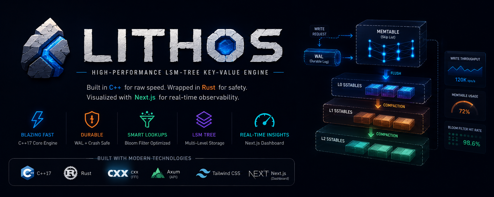
</p>


<h1 align="center">Lithos</h1>

<p align="center">
<b>High-Performance Log-Structured Merge (LSM) Tree Key-Value Storage Engine</b>
</p>

<p align="center">


</p>

---

## Overview

Lithos is a custom-built embeddable key-value database built around a Log-Structured Merge Tree (LSM Tree).

The storage engine is implemented in **C++17**, exposed safely through a **Rust cxx FFI bridge**, and monitored through a **Next.js telemetry dashboard**.

### Highlights

- Skip List MemTable
- Write Ahead Log (WAL)
- Sorted String Tables (SSTables)
- Multi-Level Storage
- Background Compaction
- Bloom Filters
- Compression
- Rust ↔ C++ Zero-cost FFI
- Axum REST API
- Live Dashboard

---

# Table of Contents

- Architecture
- Features
- Tech Stack
- Write Path
- Read Path
- LSM Layout
- Compaction
- Bloom Filters
- Storage Hierarchy
- Request Lifecycle
- Project Structure
- Dashboard
- API
- Getting Started
- Roadmap
- Project Status

---

## Preview

<p align="center">
    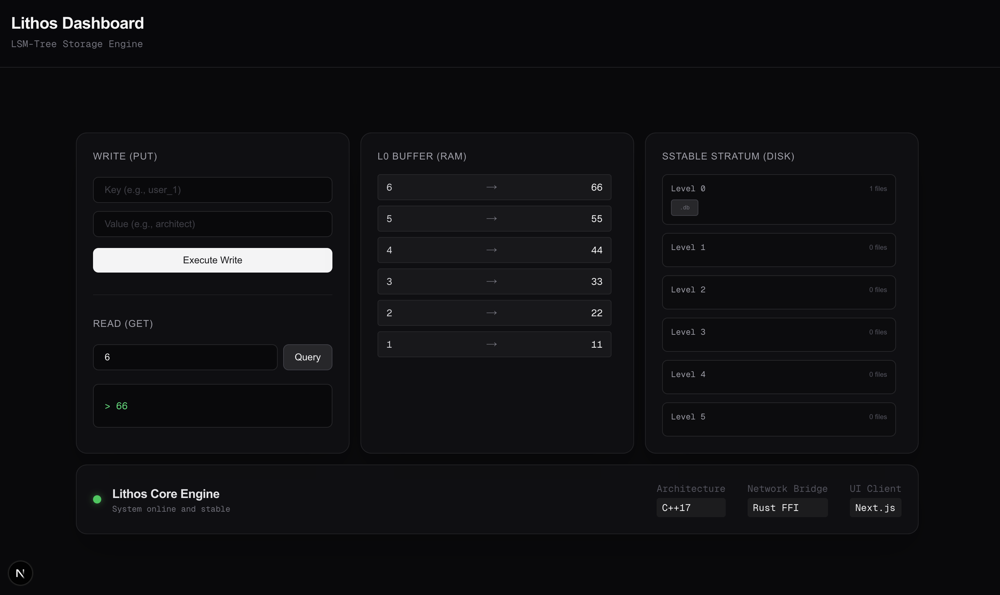
</p>


# System Architecture

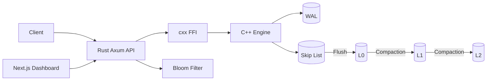

<p align="center">
    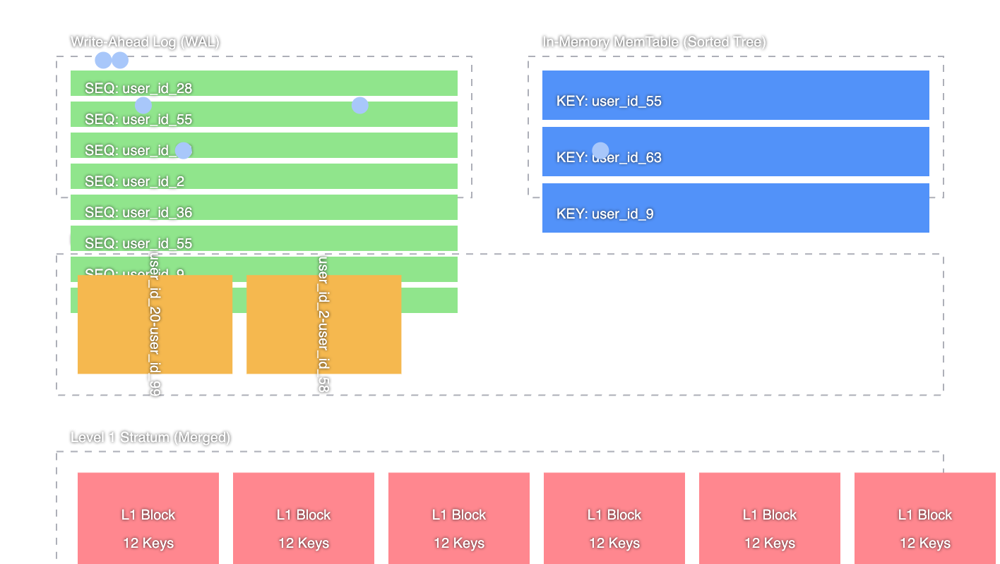
</p>

# Features

| Feature | Status |
|---------|--------|
| Skip List MemTable | ✅ |
| WAL | ✅ |
| SSTables | ✅ |
| Multi-Level SSTables | ✅ |
| Bloom Filter | ✅ |
| Background Compaction | ✅ |
| Compression | ✅ |
| Rust FFI | ✅ |
| REST API | ✅ |
| Live Dashboard | ✅ |

# Tech Stack

| Layer | Technology |
|------|------------|
| Storage Engine | C++17 |
| FFI | Rust cxx |
| Backend | Rust + Axum |
| Frontend | Next.js |
| UI | Tailwind CSS |

## Zero-Cost FFI

Lithos communicates between Rust and C++ through the `cxx` crate with negligible overhead.

<p align="center">
    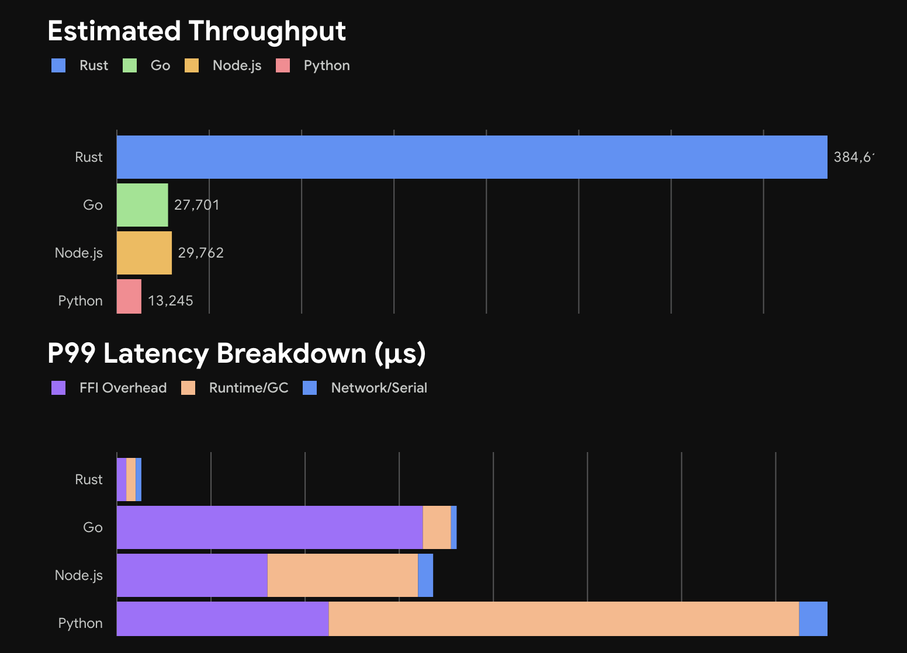
</p>

# Write Path

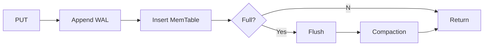

# Read Path

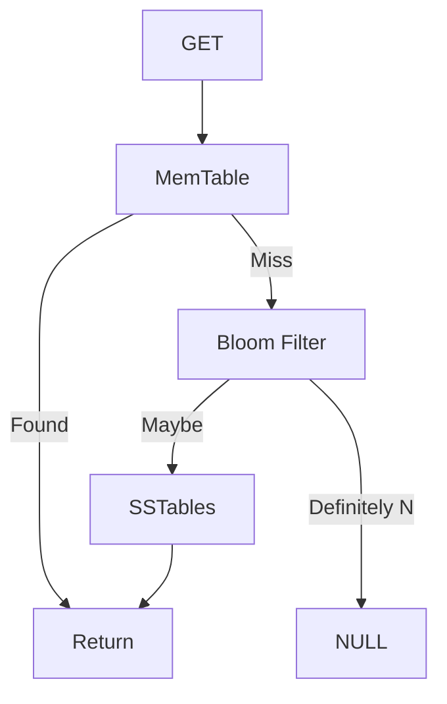

# LSM Tree

```text
Memory
┌─────────────┐
│ MemTable    │
└─────┬───────┘
      │ Flush
      ▼
┌─────────────┐
│ L0 SSTables │
└─────┬───────┘
      │ Compaction
      ▼
┌─────────────┐
│ L1 SSTables │
└─────┬───────┘
      ▼
┌─────────────┐
│ L2 SSTables │
└─────────────┘
```

<p align="center">
    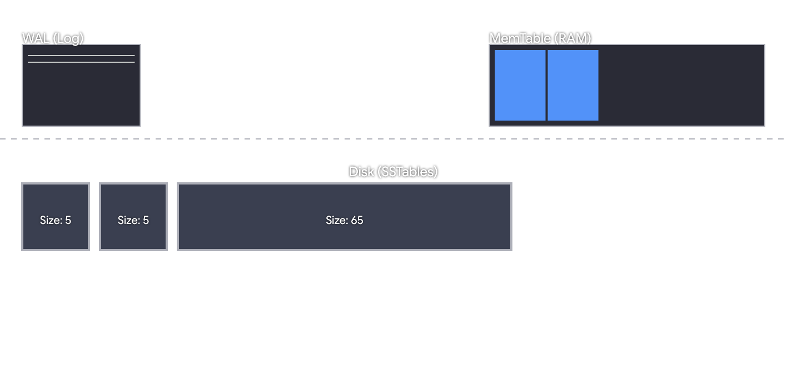
</p>

# Flush Lifecycle

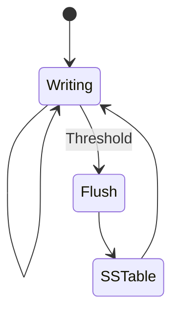

# Skip List (MemTable)

The MemTable uses a probabilistic Skip List for O(log n) insertion and lookup.

<p align="center">
    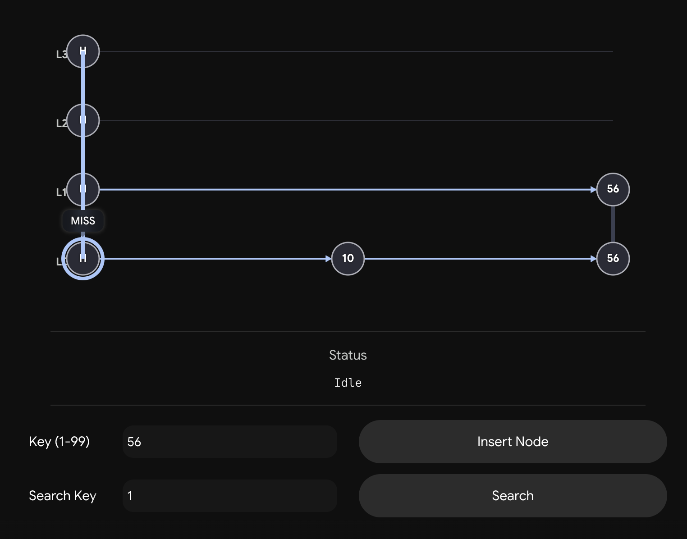
</p>

# Compaction

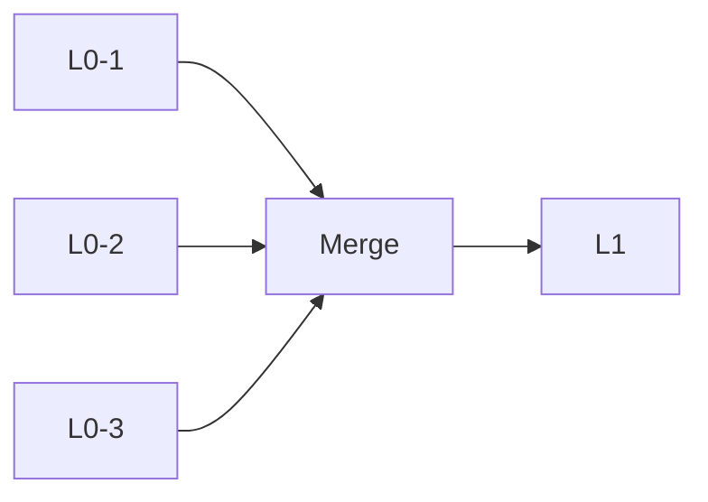

# Bloom Filter

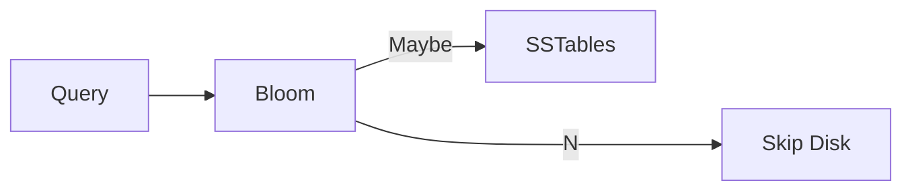

# Request Lifecycle

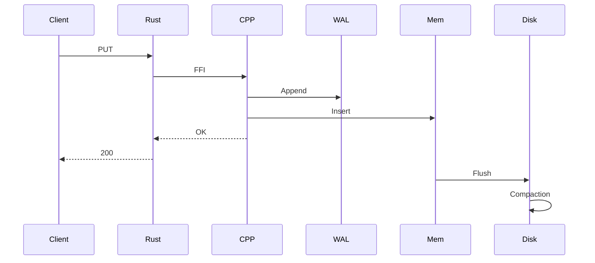

# Project Structure

```text
Lithos/
├── engine/
├── backend/
├── frontend/
├── ffi/
├── docs/
└── data/
```

# Deployment Topology

<p align="center">
    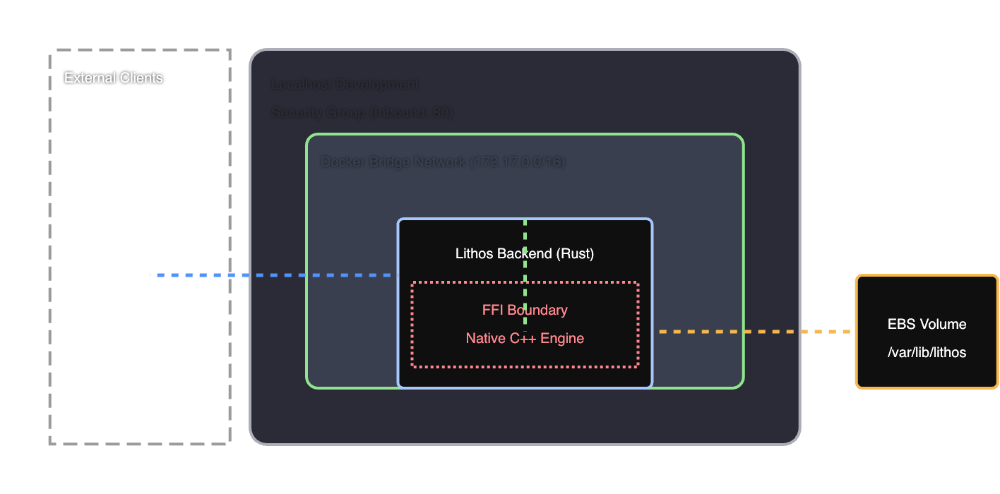
</p>

# Dashboard

The dashboard visualizes:

- MemTable occupancy
- WAL activity
- SSTables
- Compaction
- Bloom filter efficiency
- Storage hierarchy
- Query metrics
- Disk usage

> Add screenshots or GIFs:
>
> - docs/assets/dashboard.png
> - docs/assets/demo.gif

# REST API

## PUT

```bash
curl -X POST http://localhost:8080/set \
-H "Content-Type: application/json" \
-d '{"key":"hello","value":"world"}'
```

## GET

```bash
curl http://localhost:8080/get?key=hello
```

# Getting Started

## Backend

```bash
cd backend
cargo run
```

## Frontend

```bash
cd frontend
npm install
npm run dev
```

Open:

```
http://localhost:3000
```

# Roadmap

- Distributed replication
- MVCC
- Transactions
- Range scans
- Parallel compaction
- Block cache
- SIMD optimizations

# Project Status

- [x] Core LSM Engine
- [x] WAL
- [x] Skip List
- [x] Bloom Filters
- [x] Multi-Level SSTables
- [x] Background Compaction
- [x] Compression
- [x] Rust FFI
- [x] Axum API
- [x] Next.js Dashboard

---

Built as a systems engineering project focused on storage engines, database internals, and high-performance systems programming.
